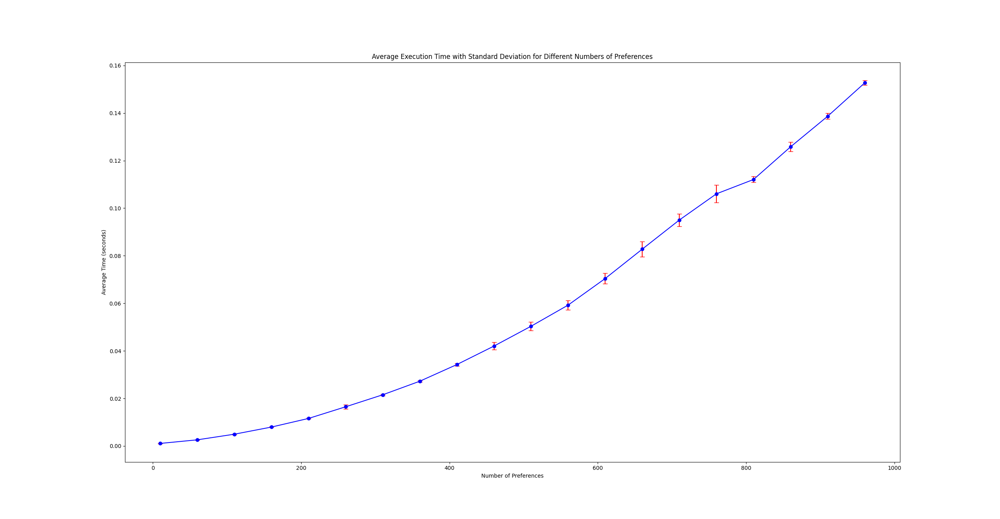

# Stable Marriage Problem

This project implements the Gale-Shapely algorithm to solve the Stable Marriage Problem.

## Problem Description

The Stable Marriage Problem is defined as follows: given n individuals from two sets, where each person has ranked all members of the other set in order of preference, pair the individuals together such that there are no two people who would both rather have each other than their current partners. When there are no such pairs of people, the set of pairings is deemed stable.

## Implementation

The project is implemented in C++. It includes three main classes:

- `A`: Represents one set of participants in the problem.
- `B`: Represents the other set of participants in the problem.
- `GaleShapelyAlgorithm`: Implements the Gale-Shapely algorithm to solve the problem.

## Usage

To use this project, compile and run the main.cpp file. The program will output whether the current set of pairings is stable.

## Future Work

Future updates will include more detailed output and additional features such as the ability to input your own preferences.

# Stable Marriage Problem

This project implements the Gale-Shapely algorithm to solve the Stable Marriage Problem.

## Problem Description

The Stable Marriage Problem is defined as follows: given n individuals from two sets, where each person has ranked all members of the other set in order of preference, pair the individuals together such that there are no two people who would both rather have each other than their current partners. When there are no such pairs of people, the set of pairings is deemed stable.

## Implementation

The project is implemented in C++. It includes three main classes:

- `A`: Represents one set of participants in the problem.
- `B`: Represents the other set of participants in the problem.
- `GaleShapelyAlgorithm`: Implements the Gale-Shapely algorithm to solve the problem.

## Performance

The Gale-Shapely algorithm has a worst-case time complexity of O(n^2). Here's a graph of the algorithm's runtime:

## Future Work

I am currently designing an algorithm based on Hamiltonian cycles to improve the performance of the Gale-Shapely algorithm. This new algorithm aims to reduce the time complexity and make the solution more efficient.

In addition to this, future updates will include more detailed output and additional features such as the ability to input your own preferences.
